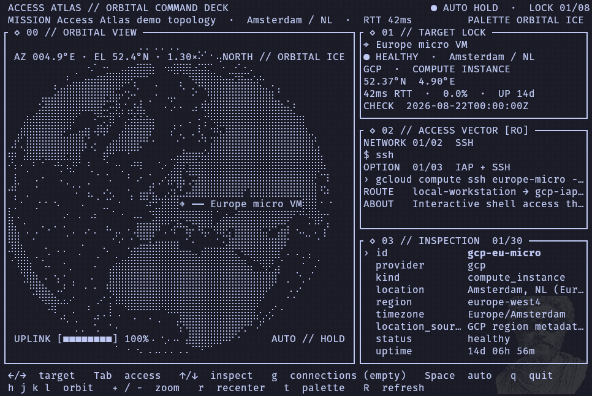

# Access Atlas

[](https://github.com/Idanbot/access-atlas/actions/workflows/ci.yml)
[](https://www.rust-lang.org/)
[](LICENSE)

**See every environment you can reach, understand how access is wired, and get the right command without hunting through five CLIs.**

Access Atlas is a local-first terminal control map for infrastructure access. It discovers connection metadata already present in `kubectl`, AWS, gcloud, Azure, Terraform, SSH, Docker, Tailscale, and Cloudflare configuration, then turns it into a searchable geographic inventory with context-aware connect, port-forward, and debug command templates.

It does not execute generated commands. You inspect and copy them explicitly.



> The recording uses the repository's entirely mocked topology. Its hosts, addresses, project names, and account identifiers are fictional.

## Why this should exist

Infrastructure access is usually fragmented across kube contexts, cloud profiles, SSH aliases, tunnels, Terraform roots, and tribal knowledge. During an incident, migration, or onboarding session, the expensive question is often not *what tool should I use?* but *what can this workstation reach, through which identity and route, and what is the safest useful command?*

Access Atlas makes that access surface visible:

- **Incident response:** find the relevant target and copy a metadata-correct diagnostic command quickly.
- **Onboarding and workstation audits:** see which environments are configured, missing, duplicated, or stale.
- **Context safety:** keep provider, account, project, region, cluster, namespace, and route visible beside every command.
- **Access cleanup:** compare authored topology with locally discovered connections and expose unlocated or orphaned entries.
- **Low-risk exploration:** local discovery is the default; online provider inventory is always an explicit action.

The product is intentionally an **operator cockpit and access inventory**, not a credential vault, remote shell, or cloud resource manager.

## Quick start

Requirements: Rust 1.88+ (edition 2024) and a terminal with Unicode, true-color, and OSC52 clipboard support.

Safe first run — mocked topology only. No cache, no provider CLIs:

```sh
git clone https://github.com/Idanbot/access-atlas.git
cd access-atlas
cargo run --release -- --demo-only
```

Default run is origin plus inventory, not the demo globe. On open, a modal asks whether to load connections or skip. Approval fetches all local `kubectl`, cloud, SSH, Docker, Tailscale, and Cloudflare metadata. Skip keeps any cache already on disk and does not scan. The inventory pane is the default; press `m` or pass `--globe` for the map. Provider APIs are not called until you press `R` on a selected connection.

```sh
cargo run --release
```

Isolated Docker demo. No host mounts, no discovery, `--demo-only`:

```sh
docker build --tag access-atlas:demo .
docker run --rm -it access-atlas:demo
```

Validate the fixture without opening the TUI:

```sh
cargo run -- --validate
```

## What you can do

The default pane is the connection inventory and command deck. Press `m` to show the Braille-dot globe: the selected located target stays in view while a great-circle uplink traces source to estimated region. Unknown geo is labeled **No location** and is not pinned on the origin city. Estimated region comes from a built-in gazetteer or `~/.config/access-atlas/locations.json`. Authored `--data` overlays can mark matched and orphan targets; the live session does not write topology.

Discovered health starts as **NOT PROBED**. Press `P` to run a single explicit `ping`. Demo fixture health stays authored.

### Find discovered connections

Press `g` to open a keyboard-controlled connection browser overlay, including when the inventory is empty. `Tab`/`Shift+Tab` filter by provider, `/` searches labels, kinds, and metadata, arrows move the selection, `Enter` focuses a target, and `g` or `Esc` closes the overlay.

Discovery sources:

| Provider | Local metadata | Explicit online inventory |
| --- | --- | --- |
| Kubernetes | contexts and namespaces from `kubectl` | — |
| AWS | configured profiles | EC2 instances |
| Google Cloud | gcloud configurations | Compute Engine instances |
| Azure | subscriptions | virtual machines |
| Terraform | selected roots and workspaces | — |
| SSH | configured host aliases | — |
| Docker | contexts | — |
| Tailscale | peer metadata | — |
| Cloudflare | Tunnel ingress entries | — |

Local discovery runs only after you approve the load prompt (or pass `--discover`). Press uppercase `R` on a selected connection to query that provider (and profile/configuration/subscription when known). `C` cancels between provider commands. Successful scans remove vanished entries for loaded providers; a failed provider retains its last known cache entries.

Each resource gets commands matched to its provider, resource kind, and discovered metadata. High-value actions stay one keystroke away with `Tab` and `Shift+Tab`. Press `Enter` on a discovered connection to open its command library, then `y` to copy. Copy uses OSC52 and, when available, the native clipboard (`wl-copy` / `pbcopy` / `xclip`). The footer reports `copied N chars`.

Access Atlas only renders and copies templates—it never executes them. `P` is a separate explicit probe, not a generated command.

## Controls

| Key | Action |
| --- | --- |
| `Left` / `Right` | Previous / next target, or move in the connection browser |
| `Tab` / `Shift+Tab` | Next / previous primary command, browser provider, or load-prompt choice |
| `Up` / `Down` | Move the selected detail, connection, or command row |
| `Enter` | Confirm the load prompt, focus a browser row, or open/close the command library |
| `/` | Search the connection browser or command library |
| `Esc` | Skip the load prompt, clear search, or close the active overlay |
| `y` | Copy the selected command (OSC52 + native fallback); never execute it |
| `g` | Open/close the grouped connection browser overlay |
| `m` | Toggle globe vs inventory pane |
| `R` | Online refresh for the selected connection's provider |
| `P` | Probe the selected target with `ping` |
| `C` | Cancel refresh after the current provider command returns |
| `Space` | Pause/resume automatic target cycling (paused by default) |
| `t` | Cycle five color themes |
| `+` / `-` | Zoom in/out |
| `h` / `j` / `k` / `l` | Orbit longitude/latitude |
| `r` | Recenter on the focused target |
| `q` | Quit |

## Discovery without the TUI

Run a local-only scan and print the generated inventory:

```sh
cargo run -- --discover
```

Explicitly allow provider API queries:

```sh
cargo run -- --discover --online
```

Audit configured providers and every generated template without executing any generated command:

```sh
cargo run -- --discover --audit-connections
```

Acceptance fails for duplicate IDs, empty or malformed command sets, multiline/control-character commands, unresolved placeholders, or credential-shaped metadata keys. Missing tools and invalid overrides remain warnings so one provider cannot make the rest unusable.

Useful configuration:

| Option / variable | Purpose |
| --- | --- |
| `--data PATH` | Optional authored overlay (matched / orphan); default live run is origin plus inventory |
| `--globe` | Start with the globe instead of the inventory pane |
| `--connections-cache PATH` / `ACCESS_ATLAS_CACHE` | Override the generated inventory cache |
| `--discovery-home PATH` / `ACCESS_ATLAS_HOME` | Use an isolated discovery home |
| `--demo-only` | Skip the cache and all local/provider discovery |
| `--cache-max-age-hours HOURS` | Change cache lifetime; `0` disables cache loading |
| `--terraform-root PATH` | Add an explicit Terraform discovery root |
| `--template-overrides PATH` | Load versioned command-template overrides |

Discovery never mutates the authored topology in `data/demo-topology.json`. There is no topology writer; the cache is the durable live document.

## Template overrides

The default override path is `~/.config/access-atlas/templates.json`. Overrides match `provider` plus `resource_kind` and can replace a built-in command by `id` or insert a new command at a position. Metadata placeholders such as `{context}`, `{namespace}`, `{profile}`, and `{hostname}` are validated and shell-quoted before insertion. Invalid entries are ignored individually and the safe built-in remains active.

```sh
cargo run -- --discover \
  --template-overrides docs/template-overrides.example.json
```

See the [complete override example](docs/template-overrides.example.json).

## Safety and privacy model

- Generated commands are never run by Access Atlas.
- `--demo-only` avoids reading cached connections and invoking provider tools.
- Local CLI discovery runs only after the load prompt is approved, or with `--discover`. `--demo-only` skips the prompt.
- Online cloud discovery only happens after `--online` or uppercase `R` on a selected provider.
- `P` is an explicit one-shot `ping`, separate from generated templates.
- Discovery retains operational metadata but omits credentials and SSH identity-file contents.
- The inventory cache is separate from the authored demo topology and is written owner-read/write only (`0600`).
- Template values are validated and shell-quoted before interpolation.
- Copying is explicit (OSC52 plus native clipboard when present); there is no shell handoff.

Treat the generated cache as operational metadata: it can contain internal hostnames, account IDs, project names, and topology details. Avoid committing it.

## Demo data and map sources

The embedded fixture models GCP VMs, a Raspberry Pi behind Cloudflare Access, Kubernetes clusters, a Tailscale node, an AWS instance, and an Azure VM. All addresses are documentation/private ranges and all identifiers are fake.

Coastlines and country boundaries use public-domain [Natural Earth 50m data](https://github.com/nvkelso/natural-earth-vector), embedded in `data/ne_50m_land.json` and `data/ne_50m_boundaries.json`. The renderer builds high-resolution masks with spatial-grid acceleration and samples them during frames.

## Development and tests

Run the complete local quality gate:

```sh
cargo fmt --all -- --check
cargo clippy --all-targets --all-features -- -D warnings
cargo test --all-targets
cargo run -- --validate
```

Run formatting, Clippy, tests, and JSON validation in a toolchain container:

```sh
./scripts/docker-check.sh
```

Mock-provider discovery (isolated home, fake CLIs, no real accounts) lives in `tests/container/` and the `mock-connections` job in Access Atlas CI. The root `Dockerfile` is only the `--demo-only` image.

## License

MIT. See [LICENSE](LICENSE).

## Security

Report vulnerabilities through [GitHub private reporting](https://github.com/Idanbot/access-atlas/security/advisories/new), not public issues. See [SECURITY.md](SECURITY.md).
